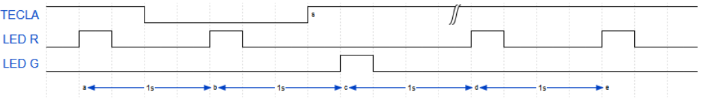

# Resolución de ejercicio D4 de Guia de ejercitación de RTOS de CESE (2021)
Autor:
Fernando Prokopiuk <fernandoprokopiuk@gmail.com>

Implementar dos tareas:

Tarea 1: Medirá el tiempo de pulsación de un botón, aplicando anti-rebote. Liberará un semáforo al obtener la medición.

Tarea 2: Esperará el semáforo cada un segundo. Si recibe el semáforo se destellará el LED verde y si no recibe el semáforo destellará el LED rojo.

